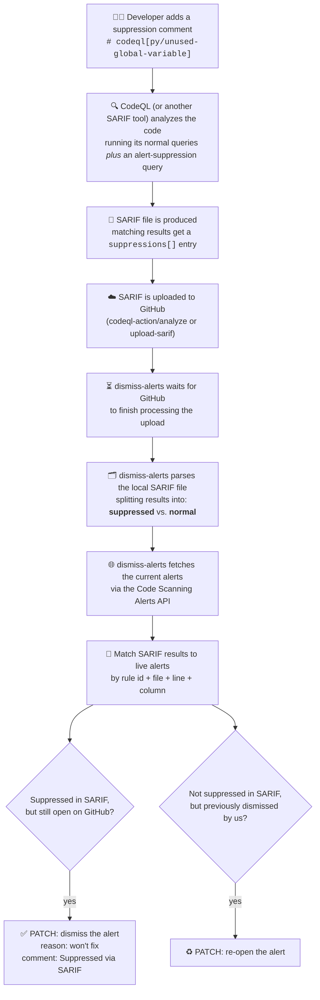

# Dismiss Alerts Action 

The `dismiss alerts` action [dismisses](https://docs.github.com/en/code-security/code-scanning/automatically-scanning-your-code-for-vulnerabilities-and-errors/managing-code-scanning-alerts-for-your-repository) code scanning alerts based on the `suppression` [property](https://docs.oasis-open.org/sarif/sarif/v2.0/csprd02/sarif-v2.0-csprd02.html#_Toc10127852) in the SARIF file. 

There are two required input fields for this action: 
- `sarif-upload-id` - the SARIF identifier
- `sarif-file` - the location of the SARIF file or directory containing SARIF files. When a directory is provided, all `.sarif` and `.sarif.json` files will be processed recursively.

## High Level Architecture 

The `suppressions[]` object in the sarif is used to create a list of suppressed alerts. The API's are used to retrieve a list of already dismissed alerts. These two lists are mapped using the alert identifier (rule and location).  A comparison is done between these lists and any alert that has not already been dismissed is updated with a PATCH request using the `github/alertUrl` property. The alert `state` is updated to `dismissed` with the `dismissed reason` being `won't fix` and the `dismissed comment` being `Suppressed via SARIF`. Vice versa, any alerts that are dismissed with a comment `Suppressed via SARIF` in the Code Scanning UI are re-opened, if they are no longer marked as suppressed in the SARIF file.

Here's the same flow end-to-end, from the moment a developer adds a suppression comment to the moment the alert is dismissed (or re-opened) on GitHub:



## Getting Started 

CodeQL populates the `suppression` property in its SARIF output based on the results of `alert-suppression` queries. A user can provide their own custom alert-suppression query, or use the ones that we provide (`//lgtm` or `//codeql` style comments).

### Example - CodeQL 

```yaml
name: "CodeQL Advanced"

on:
  push:
    branches: [main]
  pull_request:
    branches: [main]
  schedule:
    - cron: "31 7 * * 3"
jobs:
  analyze:
    name: Analyze (${{ matrix.language }})
    runs-on: ubuntu-latest
    permissions:
      security-events: write
      packages: read
      actions: read
      contents: read

    strategy:
      fail-fast: false
      matrix:
        include:
        - language: java-kotlin
          build-mode: none
          query: codeql/java-queries:AlertSuppression.ql        

    steps:
    - name: Checkout repository
      uses: actions/checkout@v4

    - name: Initialize CodeQL
      uses: github/codeql-action/init@v3
      with:
        languages: ${{ matrix.language }}
        build-mode: ${{ matrix.build-mode }}
        packs: ${{ matrix.query }}

    - name: Perform CodeQL Analysis
      # define an 'id' for the analysis step
      id: analyze
      uses: github/codeql-action/analyze@v2
      with:
        category: "/language:${{matrix.language}}"
        # define the output folder for SARIF files
        output: sarif-results
        
    - name: Dismiss alerts
      if: github.ref == 'refs/heads/main'
      uses: advanced-security/dismiss-alerts@v2
      with:
         # specify a 'sarif-id' and 'sarif-file'
        sarif-id: ${{ steps.analyze.outputs.sarif-id }}
        sarif-file: sarif-results/${{ matrix.language }}.sarif
      env:
        GITHUB_TOKEN: ${{ github.token }}
```

### Third party produced SARIF file 

The `dismiss-alerts` action can be used with SARIF files from third party providers.

``` yaml
on:
  push:

jobs:
  check-codeql-versions:
    runs-on: ubuntu-latest

    permissions:
      security-events: write

    steps:
    - name: Checkout code
      uses: actions/checkout@v3
    
    - name: Run SAST scan
      run: sast-scan.sh --output=scan-results.sarif
      
    - name: Upload scan results
      # define an 'id' for the upload step
      id: upload
      uses: github/codeql-action/upload-sarif@v2
      with:
        # specify the SARIF file to upload
        sarif_file: scan-results.sarif
        wait-for-processing: true

    - name: Dismiss alerts
      if: github.ref == 'refs/heads/main'
      uses: advanced-security/dismiss-alerts@v1
      with:
        # specify a 'sarif-id' and 'sarif-file'
        sarif-id: ${{ steps.upload.outputs.sarif-id }}
        sarif-file: scan-results.sarif
      env:
        GITHUB_TOKEN: ${{ github.token }}        
```

### Using a directory of SARIF files

Tools like Checkov can output multiple SARIF files in a directory. The `sarif-file` input supports both a single file path and a directory path. When a directory is provided, all `.sarif` and `.sarif.json` files will be processed recursively.

``` yaml
on:
  push:

jobs:
  checkov-scan:
    runs-on: ubuntu-latest

    permissions:
      security-events: write

    steps:
    - name: Checkout code
      uses: actions/checkout@v3
    
    - name: Run Checkov
      run: |
        mkdir -p checkov-results
        checkov --directory . --output sarif --output-file-path checkov-results
      
    - name: Upload scan results
      # define an 'id' for the upload step
      id: upload
      uses: github/codeql-action/upload-sarif@v2
      with:
        # specify the directory containing SARIF files
        sarif_file: checkov-results
        wait-for-processing: true

    - name: Dismiss alerts
      if: github.ref == 'refs/heads/main'
      uses: advanced-security/dismiss-alerts@v1
      with:
        # specify a 'sarif-id' and directory containing SARIF files
        sarif-id: ${{ steps.upload.outputs.sarif-id }}
        sarif-file: checkov-results
      env:
        GITHUB_TOKEN: ${{ github.token }}        
```

## Features and Limitations 

### How suppression comments work 

CodeQL populates the SARIF `suppressions[]` property by running a special *alert-suppression* query alongside your normal queries. Each language has its own copy, e.g. [`python/ql/src/AlertSuppression.ql`](https://github.com/github/codeql/blob/main/python/ql/src/AlertSuppression.ql) for Python (every other language has an equivalent, such as [`javascript/ql/src/AlertSuppression.ql`](https://github.com/github/codeql/blob/main/javascript/ql/src/AlertSuppression.ql) or [`java/ql/src/AlertSuppression.ql`](https://github.com/github/codeql/blob/main/java/ql/src/AlertSuppression.ql)). This query looks for specially-formatted comments in your source code and, when one matches a rule that fired, tags that result's SARIF entry with `suppressions[]` - which is exactly what `dismiss-alerts` reads to decide what to dismiss.

Two comment styles are recognized:

- **`lgtm[rule-id]`** - suppresses an alert on the **same line** as the comment.
- **`codeql[rule-id]`** - suppresses an alert on the **following line** (the comment must go on the line *before* the alert).

For example, here's a real suppression comment from [`crate/crate-python`](https://github.com/crate/crate-python/blob/main/src/crate/client/__init__.py):

```python
# codeql[py/unused-global-variable]
apilevel = "2.0"
threadsafety = 1
paramstyle = "pyformat"
```

`py/unused-global-variable` fires because `apilevel` looks unused within this file, but it's actually a [PEP 249](https://peps.python.org/pep-0249/) DB-API module-level constant that other code is expected to read - a legitimate false positive. The `# codeql[py/unused-global-variable]` comment on the line above tells CodeQL's `AlertSuppression.ql` to mark that specific result as suppressed, which `dismiss-alerts` then picks up from the SARIF and dismisses on GitHub with the comment `Suppressed via SARIF`.

> [!TIP]
> Prefer the `codeql[rule-id]` style (comment on the line *before* the alert) over `lgtm[rule-id]` (comment on the *same* line). Because code scanning identifies an alert partly by the hash of its own line's contents, adding a same-line comment changes that line and therefore the alert's hash - closing the original alert as `fixed` and opening a brand-new one, which is then immediately dismissed. Placing the suppression comment on the previous line avoids this churn entirely. See the note below for more detail.


- This action should run only on the default branch as the dismissal status of an alert is a global property. If this action is run on a push event to a feature branch or pull request then the suppressed alerts will also be dismissed on the default branch. 
- When a suppression comment is added on the line that contains an alert then this alert will be closed and a duplicate alert will be marked as fixed. This is because code scanning uses the hash of the alert's line contents as the unique identifier. The inserted suppression comment changes the contents of the line, and therefore also the hash of the alert. Since the alert hash no longer matches the original alert is considered `fixed` and a new alert is created in its place. The new alert is immediately marked as `dismissed` as a result of the suppression comment. To avoid this problem it is recommended to use a suppression style that allows placing suppression markers on the line before an alert.
